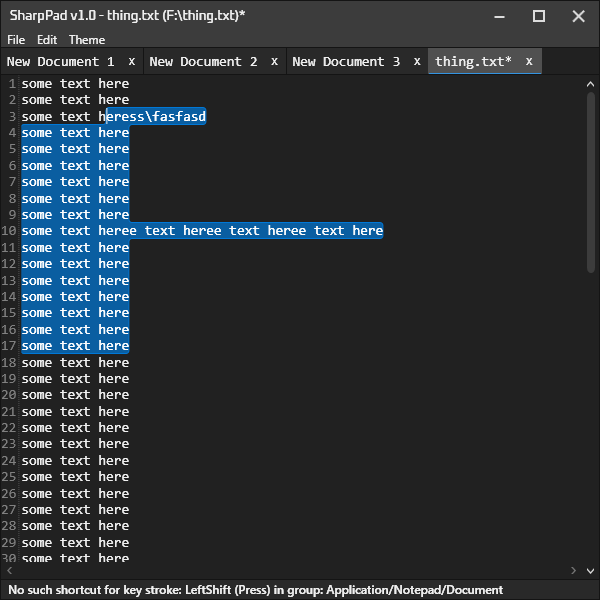

# SharpPad
A notepad app that uses WPF, and AvalonEdit as a text editor.

A lot of the code files are copied from my other project [FramePFX](https://github.com/AngryCarrot789/FramePFX), which
has more details about how they work if you want to read more

## Preview

# Licence
All source files in FramePFX are under the GNU General Public License version 3.0 or later (GPL v3.0+). 
FramePFX uses libraries that have other licences, such as MIT/LGPL licences.
