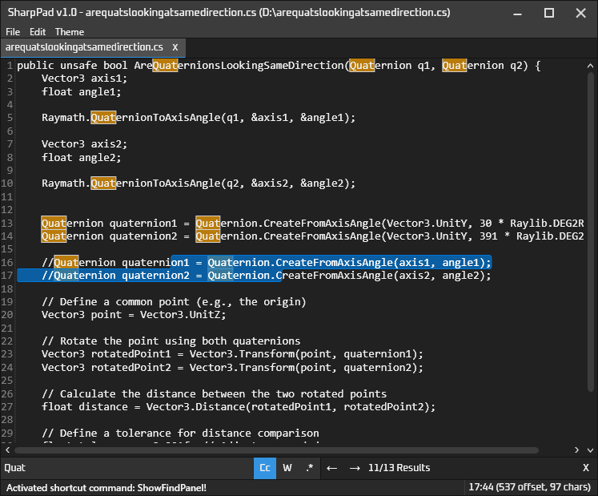

# SharpPad
A notepad app that uses WPF, and AvalonEdit as a text editor.

A lot of the code files are copied from my other project [FramePFX](https://github.com/AngryCarrot789/FramePFX), which
has more details about how they work if you want to read more

## Preview `1.0.2`

## Codebase
- `Notepad`: there is one of these associated wh each notepad window. This contains a collection of `NotepadEditor` instances, and an `ActiveEditor` property (as in, selected tab/editor)
- `NotepadEditor`: Contains a reference to a `NotitepadDocument` which is what the editor is presenting. Editors also contain a `FindAndReplaceModel` object, a reference to the currently 
  viewing AvalonEdit text editor control, and a list of owner `Notepad` instances (aka a list of notepads that contain the editor in their editor collection mentioned above)
- `NotepadDocument`: Contains the text for a document and other things too like file path, name, modified state, etc.

### Object Ownership
- A `NotepadDocument` can be associated with multiple `NotepadEditor` instances (though you can't do it in the UI as of yet).
- A `NotepadEditor` can only be associated with one `Notepad`.
- A `Notepad` is associated with a single window. If i ever implement split-view, then this could change depending on how I implement it

The reason why `NotepadEditor` exists is to support the same document existing multiple times in any UI, while allowing separate editor-specific things 
like the find model to exist outside of the document. There is currently only one instance of AvalonEdit's `TextEditor` per window, and the `NotepadEditor` 
is used to mimic the behaviour of there being multiple instances of `TextEditor` for each document present in the UI 

### Other things
This app uses the command, shortcut and context data management system as FramePFX, except this version contains new and improved updates.

Rather than commands be associated with instances of objects (like you would in MVVM), each command is typically a singleton, referenceable by a string identifier.

The shortcut system uses the command system to do work. In order for commands to access relevant data, it uses the `DataManager` class, which manages a hierarchy of 
context data, which can be used by commands to do their work.

You can read more about these systems here: https://github.com/AngryCarrot789/FramePFX/blob/master/README.md#command-system-shortcut-system-and-context-menus

# Licence
All source files in SharpPad are under the GNU General Public License version 3.0 or later (GPL v3.0+)
